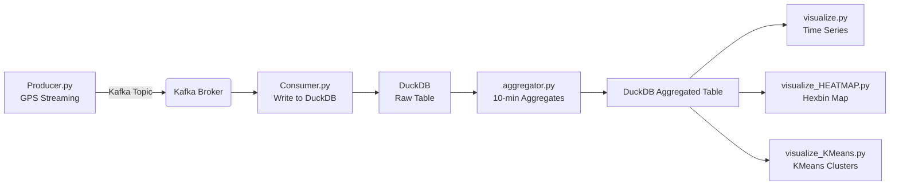

# 🌆 Urban Mobility & Traffic Flow Forecasting

**Real-Time Streaming Pipeline for Taxi GPS Data using Kafka, Python, DuckDB & Geospatial Analytics**

Этот проект — практическая реализация потокового конвейера (streaming pipeline) для анализа городской мобильности на основе GPS-треков такси. Он демонстрирует навыки работы с:

* Kafka (producer/consumer)
* потоковой передачей данных
* DuckDB как аналитическим хранилищем
* геопространственной визуализацией
* агрегацией временных рядов
* подготовкой данных для последующего прогнозирования трафика

Проект одновременно является:

✔ учебным pet-project для портфолио
✔ реалистичным streaming-pipeline для urban mobility
✔ частью большого проекта **Traffic Prediction Pipeline**

---

# 📌 **Оглавление**

1. Описание проекта
2. Архитектура Pipeline
3. Используемые технологии
4. Структура проекта
5. Функциональность файлов
6. Инструкция по запуску
7. Примеры работы
8. Roadmap

---

# 🧭 **Описание проекта**

Городская мобильность (Urban Mobility) — один из ключевых источников данных для анализа транспортной нагрузки, построения карт трафика и прогнозирования движения транспорта.
GPS-трекеры в такси сегодня заменяют датчики на дорогах, позволяя в реальном времени собирать координаты и временные отметки.

### 📍 Rome Taxi Dataset

Проект использует выборку GPS-координат реальных такси в Риме:

```
taxi_id  
lat  
lon  
timestamp
```

Имитируется поток GPS-точек такси:
**Producer → Kafka → Consumer → DuckDB → Aggregator → Visualization**

---

# 🔧 **Архитектура Pipeline**



---

# 🛠 **Используемые технологии**

| Компонент                   | Используется для                          |
| --------------------------- | ----------------------------------------- |
| **Kafka**                   | потоковая доставка GPS-точек такси        |
| **Python**                  | producer, consumer, анализ и визуализация |
| **DuckDB**                  | аналитическое хранилище, OLAP-запросы     |
| **Pandas**                  | обработка данных                          |
| **Matplotlib**              | визуализация                              |
| **GeoPandas / Shapely**     | геопространственные операции              |
| **Scikit-learn**            | кластеризация (KMeans)                    |
| **Docker / docker-compose** | запуск Kafka                              |

---

# 📂 **Структура проекта**

```
.
├── aggregator.py                     # Агрегация данных каждые 10 минут
├── consumer.py                      # Базовый consumer Kafka → DuckDB
├── consumer_optimized.py            # Оптимизированный consumer с буферизацией
├── consumer.log                     # Логи консюмера
├── docker-compose.yml               # Kafka + Zookeeper
├── gps_data.duckdb                  # DuckDB с сырыми GPS
├── taxi_data.duckdb                 # DuckDB с агрегатами
├── taxi_data_subset.csv             # Выборка датасета
├── producer.py                      # Producer: отправка CSV → Kafka
├── producer_from_kaggle.py          # Producer: поток с Kaggle-датасета
├── reset.py                         # Полная очистка и пересоздание окружения
├── visualize.py                     # Базовая визуализация временных рядов
├── visualize_HEATMAP (hexbin).py    # Тепловая карта координат
└── visualize_KMeans.py              # Кластеры KMeans по GPS
```

---

# 🧩 **Функциональность файлов**

### **📤 producer.py / producer_from_kaggle.py**

* считывают GPS-точки из CSV или Kaggle-датасета
* отправляют их в Kafka Topic как потоковые события
* каждое событие содержит: id такси, lat, lon, timestamp

---

### **📥 consumer.py**

* принимает сообщения из Kafka
* построчно добавляет их в DuckDB

### **⚡ consumer_optimized.py**

* буферизует записи в batches
* быстрее записывает данные в DuckDB
* снижает нагрузку на Kafka + менее фрагментированное хранилище

---

### **🔄 aggregator.py**

Агрегирует данные в DuckDB:

* группировка по 10-минутным интервалам
* количество точек (`total_points`)
* средняя широта/долгота (`avg_lat`, `avg_lon`)
* сохранение в отдельную таблицу `taxi_aggregates`

---

### **📊 visualize.py**

Строит временные графики:

* суммарные точки по времени
* средние координаты
* динамика трафика

---

### **🔥 visualize_HEATMAP (hexbin).py**

Создаёт **hexbin heatmap**:

* плотность GPS-координат
* карта активности города
* полезно для анализа пробок / кластеров

---

### **🧭 visualize_KMeans.py**

Применяет **кластеризацию**:

* KMeans по GPS-точкам
* выделяет районы активности
* отображает центроиды

---

### **🧹 reset.py**

Полная перезагрузка окружения:

* удаляет DuckDB файлы
* пересоздаёт таблицы
* очищает Kafka топики

---

# 🚀 **Инструкция по запуску**

## 1️⃣ Создать виртуальное окружение

```bash
python3 -m venv venv
source venv/bin/activate
```

## 2️⃣ Установить зависимости

```bash
pip install -r requirements.txt
```

## 3️⃣ Запустить Kafka

```bash
docker-compose up -d
```

Проверить:

```bash
docker ps
```

## 4️⃣ Запустить consumer

```bash
python consumer.py
```

или оптимизированную версию:

```bash
python consumer_optimized.py
```

## 5️⃣ Запустить producer

```bash
python producer.py
```

## 6️⃣ Проверить данные в DuckDB

```bash
duckdb
> SELECT COUNT(*) FROM gps_data;
> SELECT * FROM gps_data LIMIT 5;
```

## 7️⃣ Выполнить агрегацию

```bash
python aggregator.py
```

## 8️⃣ Визуализация

```bash
python visualize.py
python visualize_HEATMAP\ (hexbin).py
python visualize_KMeans.py
```

---

# 📊 **Примеры работы**

### 📈 Потоковая запись:

```
[Producer] Sent: taxi_id=10234 lat=41.89 lon=12.49 timestamp=2014-02-01 00:00:12
[Consumer] Inserted batch of 500 rows
```

### 🧩 Агрегированные данные:

```
interval_10min         total_points    avg_lat      avg_lon
2014-02-01 00:00:00    2390            41.8921      12.4982
2014-02-01 00:10:00    2521            41.8914      12.4967
```

### 🗺 Что генерируют скрипты визуализаций

* **Heatmap** показывает плотные районы Рима
* **KMeans** выделяет транспортные зоны
* **Временной график** показывает пики нагрузки в течение суток

---

# 🎯 **Roadmap**

### 🔜 **Ближайшие улучшения**

* ML-модель для **прогнозирования трафика**
* Предсказание плотности GPS-точек на карте
* Автоматический scheduler для агрегаций
* Dashboard (Streamlit / Superset)
* Поддержка WebSocket для реального real-time UI

### 🔭 **Долгосрочные планы**

* Обучение модели на агрегированных временных рядах
* Построение карт интенсивности движения по часам
* Продвинутая геоаналитика (H3, spatial joins)

---

# 🤝 **Для кого этот проект**

Этот репозиторий идеально подойдёт:

* Data Engineer (Kafka / ETL / streaming)
* Data Scientist (подготовка данных + геоаналитика)
* Python Developer
* ML Engineer (time series forecasting)
