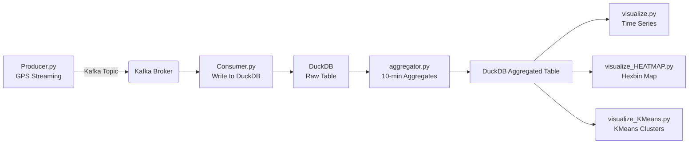

# 🌆 Urban Mobility & Traffic Flow Forecasting

**Real-Time Streaming Pipeline for Taxi GPS Data using Kafka, Python, DuckDB & Geospatial Analytics**

This project is a practical implementation of a streaming pipeline for analyzing urban infrastructure based on GPS taxi tracks. It demonstrates the skills of working with:

* Kafka (producer/consumer)
* Streaming data
* DuckDB as an analytical repository
* Geospatial visualization
* aggregation of time series
* preparation of data for subsequent traffic forecasting

---
# 📌 **Table of contents**

1. Project Description
2. Architectural pipeline
3. The technologies used
4. Project structure
5. File functionality
6. Launch Instructions
7. Work examples
8. The roadmap

---

# 🧭 **Project Description**

Urban Mobility is one of the key factors influencing the traffic load, the movement of the tracker maps, and traffic forecasting.
GPS trackers in taxis are constantly changing sensors on the roads, which allows you to collect coordinates and timestamps in real time.

### 📍 Rome Taxi Dataset

The project uses a sample of GPS taxi codes in Rome:

```
taxi_id  
lat  
lon  
timestamp
```

It is registered using the GPS point of view of the dachshund:
**Producer → Kafka → Consumer → DuckDB → Aggregator → Visualization**

---

# 🔧 **Pipeline Architecture**



---

# 🛠 **Technologies used**

| Component                   | Used for                                      |
| --------------------------- | ----------------------------------------------|
| **Kafka**                   | precise installation of the GPS access point  |
| **Python**                  | producer, consumer, analysis and visualization|
| **DuckDB**                  | analytical management, OLAP queries           |
| **Pandas**                  | data processing                               |
| **Matplotlib**              | vizualisation                                 |
| **GeoPandas / Shapely**     | geospatial operations                         |
| **Scikit-learn**            | classification (KMeans)                       |
| **Docker / docker-compose** | Kafka launch                                  |

---

# 📂 **Project structure**
```
.
├── aggregator.py                     # Aggregating data every 10 minutes
├── consumer.py                      # Basic consumer Kafka → DuckDB
├── consumer_optimized.py            # ОOptimized consumer with buffering
├── consumer.log                     # Consumer logs
├── docker-compose.yml               # Kafka + Zookeeper
├── gps_data.duckdb                  # DuckDB with raw GPS
├── taxi_data.duckdb                 # DuckDB with aggregates
├── taxi_data_subset.csv             # Dataset selection
├── producer.py                      # Producer: sending CSV → Kafka
├── producer_from_kaggle.py          # Producer: stream from Kaggle dataset
├── reset.py                         # Complete cleaning and re-creation of the environment
├── visualize.py                     # Basic visualization of time series
├── visualize_HEATMAP (hexbin).py    # Heat map of coordinates
└── visualize_KMeans.py              # KMeans clusters by GPS
```


# 🧩 **File functionality**

### **producer.py / producer_from_kaggle.py**

* read GPS points from CSV or Kaggle dataset
* send them to Kafka Topic as streaming events
* each event contains: taxi id, lat, lon, timestamp
---

### **consumer.py**

* accepts messages from Kafka
* adds them line by line to DuckDB

### **consumer_optimized.py**

* buffers writes to batches
* Writes data to DuckDB faster
* reduces the load on Kafka + less fragmented storage

---

### **aggregator.py**

Aggregates data in DuckDB:

* grouping by 10-minute intervals
* number of points (`total_points')
* average latitude/longitude (`avg_lat`, `avg_lon`)
* saving to a separate table `taxi_aggregates`

---

### **visualize.py**

Builds time schedules:

* summary points in time
* average coordinates
* traffic dynamics

---

### **visualize_HEATMAP (hexbin).py**

Creates **hexbin heatmap**:

* density of GPS coordinates
* City activity map
* useful for analyzing traffic jams/clusters

---

### **visualize_KMeans.py**

Applies **clusterization**:

* KMeans by GPS points
* highlights areas of activity
* displays centroids

---

### **reset.py**

A complete reboot of the environment:

* deletes DuckDB files
* recreates tables
* cleans Kafka topics

---
# 🚀 **Launch Instructions**

## 1️⃣ Create a virtual environment

```bash
python3 -m venv venv
source venv/bin/activate
```

## 2️⃣ Install Dependencies

```bash
pip install -r requirements.txt
```

## 3️⃣ Launch Kafka

```bash
docker-compose up -d
```

Check:

```bash
docker ps
```

## 4️⃣ Launch consumer

```bash
python consumer.py
```

or optimized version:

```bash
python consumer_optimized.py
```

## 5️⃣ Launch producer

```bash
python producer.py
```

## 6️⃣ Check the data in DuckDB

```bash
duckdb
> SELECT COUNT(*) FROM gps_data;
> SELECT * FROM gps_data LIMIT 5;
```

## 7️⃣ Perform aggregation

```bash
python aggregator.py
```

## 8️⃣ Vizualisation

```bash
python visualize.py
python visualize_HEATMAP\ (hexbin).py
python visualize_KMeans.py
```

---

# 📊 **Examples of work**

### 📈 Streaming recording:

```
[Producer] Sent: taxi_id=10234 lat=41.89 lon=12.49 timestamp=2014-02-01 00:00:12
[Consumer] Inserted batch of 500 rows
```

### 🧩 Aggregated data:
```
interval_10min         total_points    avg_lat      avg_lon
2014-02-01 00:00:00    2390            41.8921      12.4982
2014-02-01 00:10:00    2521            41.8914      12.4967
```
### 🗺 What visualization scripts generate

* **Heatmap** shows dense areas of Rome
* **KMeans** highlights transport zones
* **The time graph** shows the peaks of the load during the day

---

# 🎯 **Roadmap**

### 🔜 **Upcoming improvements**

* ML model for **traffic forecasting**
* Predicting the density of GPS points on the map
* Automatic scheduler for aggregations
* Dashboard (Streamlit / Superset)
* WebSocket support for real-time UI

### 🔭 **Long-term plans**

* Model training on aggregated time series
* Building traffic intensity maps by the hour
* Advanced geoanalytics (H3, spatial joins)
---

# 🤝 **Who is this project for?**

This repository would be perfect for:
* Data Engineer (Kafka / ETL / streaming)
* Data Scientist (data preparation + geoanalytics)
* Python Developer
* ML Engineer (time series forecasting)
